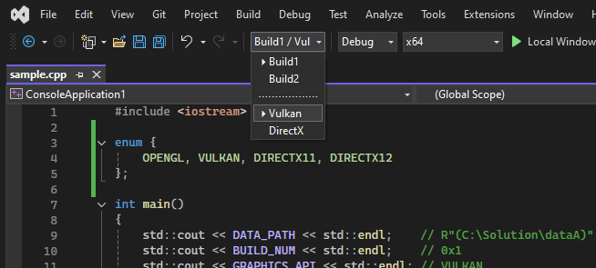

# VSESwitchEnv

**VSESwitchEnv** is a Visual Studio extension for **C++ projects** that lets you instantly switch between multiple build environments (e.g., *Local*, *Release*, *Testing*) directly from the toolbar.
It’s designed for native developers who frequently need to toggle asset paths, SDK versions, or build-time macros without manually editing project settings.

*(Requires Visual Studio 2022 and the VC++ project system.)*

---

## Overview

* Adds a **toolbar combo box** for selecting the active environment.
* Reads configuration from `.vseswitchenv` or `.editorconfig` in the solution folder.
* Automatically applies environment-specific MSBuild variables and preprocessor defines to all projects.
* Remembers and restores the last selected environment between sessions.

---

## Toolbar Preview

VSESwitchEnv adds a combo box to the main Visual Studio toolbar for quickly switching environments.
The dropdown lists all configured environments, with the current one marked by `⏵`.



---

## Configuration

Create a `.vseswitchenv` (or `.editorconfig`) file next to your solution:

```ini
# Shared paths for all projects
[env:Build1]
DataPath: = R"($(SolutionDir)dataA)"
BuildNum: = 0x1

[env:Build2]
DataPath: = R"($(SolutionDir)dataB)"
BuildNum: = 0x2

# Engine-specific graphics backends
[env:Vulkan | Engine]
GraphicsAPI: = VULKAN
ShaderPath: = "shaders/glsl"

[env:DirectX | Engine]
GraphicsAPI: = DIRECTX11
ShaderPath: = "shaders/hlsl"
```

**Syntax**

* `[env:Name]` — shared environment settings applied to all projects.
* `[env:Name | Project1,Project2]` — environment settings applied only to the listed projects.
* `Name = Value` — defines an MSBuild variable (`$(Name)`).
* `Name: = Value` — also defines a C/C++ preprocessor macro (`NAME`).

Preprocessor macros are defined *as-is*.
If you want a macro to be treated as a string, wrap the value in quotes (`"value"`) or use a raw string literal (`R"(value)"`).

---

## Example Usage

**Project Properties**

```
Working Directory:              $(DataPath)    →  $(SolutionDir)dataA
Additional Include Directories: $(ShaderPath)  →  shaders/glsl
```

**C++ Source**

```cpp
#include <iostream>

int main()
{
    std::cout << DATA_PATH << std::endl;    // R"(C:\Solution\dataA)"
    std::cout << BUILD_NUM << std::endl;    // 0x1
    std::cout << GRAPHICS_API << std::endl; // VULKAN
    std::cout << SHADER_PATH << std::endl;  // "shaders/glsl"
}
```